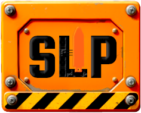

# StationeersLaunchPad

A simple mod loader for Stationeers that allows you to edit mod configuration at game startup. This is compatible with Bepinex and StationeersMods mods installed locally in the home folder or downloaded from steam workshop.

## Installation

### Fresh
- Install BepInEx into game folder
  - [Download BepInEx 5.4](https://github.com/BepInEx/BepInEx/releases/download/v5.4.23.3/BepInEx_win_x64_5.4.23.3.zip) and extract into game folder (right click game in steam, `Manage->Browse local files`).
  - should end up with `BepInEx` folder and `doorstop_config.ini` file in same folder as rocketstation.exe
  - run game once to create folder structure
  - __Linux/Steam Deck Only:__ If running on Linux/Steam Deck via Proton/Wine, you will need to [perform some additional installation steps](https://docs.bepinex.dev/articles/advanced/proton_wine.html)
    - Since you are running a windows executable via Proton, make sure to use the Windows version of BepInEx linked above.
- Install StationeersLaunchPad
  - download latest client zip from [Releases](https://github.com/StationeersLaunchPad/StationeersLaunchPad/releases)
  - extract into `BepInEx/plugins` folder

### Switch from StationeersMods
__StationeersLaunchPad and StationeersMods can't be installed together__. Both mod loaders serve the same purpose and having both installed can cause issues. StationeersLaunchPad was created to replace and upgrade StationeersMods.

- Remove `StationeersMods` folder from `Bepinex/plugins` in game folder
  - to open game folder: right click game in steam, `Manage->Browse local files`
- Install StationeersLaunchPad
  - download latest client zip from [Releases](https://github.com/StationeersLaunchPad/StationeersLaunchPad/releases)
  - extract into `BepInEx/plugins` folder

### Verify Installation
- If StationeersLaunchPad is installed correctly, you should see the LaunchPad window at the bottom of the loading screen

## Usage

- Install mods into `%HOME%/documents/my games/stationeers/mods` or download them from steam workshop.
- Start game. Mods will automatically load
- If you want to reorder or enable/disable mods, click the loading window at the bottom when the game first opens
- Mod will auto be updated unless otherwise chosen in configuration.

## Dedicated Server

- Install Bepinex into dedicated server folder
  - [Download BepInEx 5.4](https://github.com/BepInEx/BepInEx/releases/download/v5.4.23.3/BepInEx_win_x64_5.4.23.3.zip) and extract into dedicated server folder (`<steamcmd>/steamapps/common/Stationeers Dedicated Server`)
  - should end up with `BepInEx` folder and `doorstop_config.ini` file in same folder as `rocketstation_DedicatedServer.exe`
- Install StationeersLaunchPad
  - download latest server zip from [Releases](https://github.com/StationeersLaunchPad/StationeersLaunchPad/releases)
  - extract into `BepInEx/plugins` folder
- In the game client, click the loading window at the bottom on startup to open configuration
  - enable/disable and reorder mods to match what you want installed on the server
  - on the Launchpad Configuration tab, click `Export Mod Package` to create a zip file containing the enabled mods and config file
  - extract the zip file into the dedicated server folder (should create `modconfig.xml` and `mods` folder in same folder as `rocketstation_DedicatedServer.exe`)
